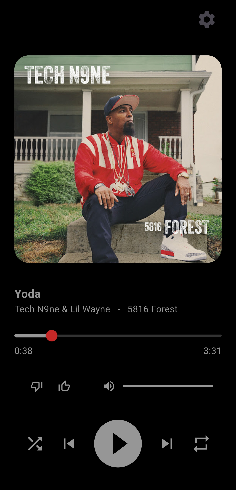
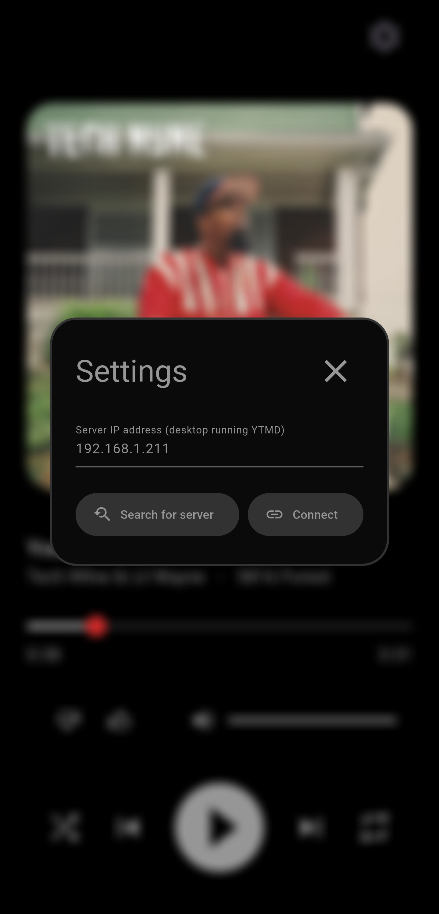
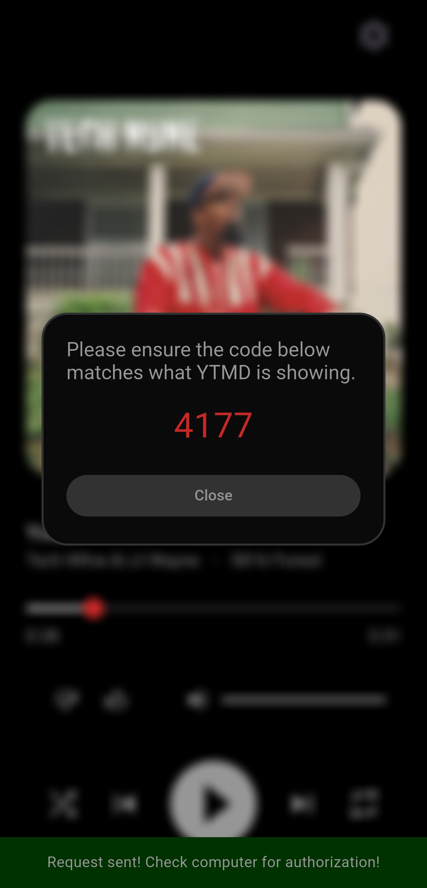
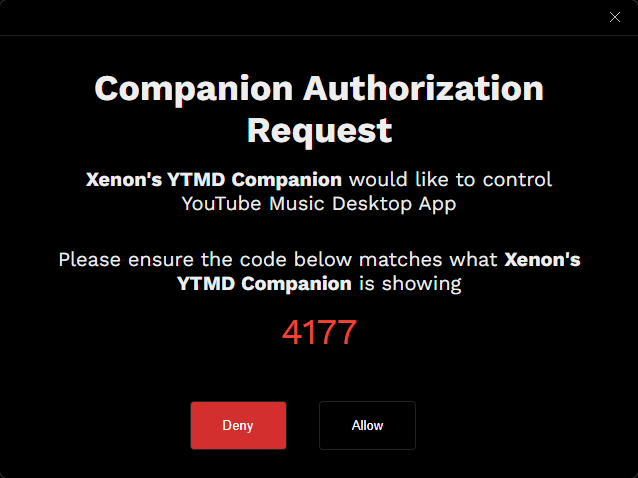

# Xenon's YTMD Companion
An Android app that integrates with the unofficial YouTube Music Desktop application for remote control and monitoring.

[Click here for YTMD](https://github.com/ytmdesktop/ytmdesktop)

# YTMD Setup
### 1. Open YouTube Music Desktop settings
### 2. Select 'Integrations' on the left side
### 3. Enable 'Companion server' and 'Enable companion authorization'
 
 

# Companion app setup
## Automatic IP search

### 1. Click the settings cog in the top-right corner
### 2. Click 'Search for server' - IP address will autofill once found
### 3. After the server is found, click 'Connect'
### 4. Confirm that the displayed codes match and click 'Allow' in YTMD

> [!NOTE]
> Auto-discover relies on an API response within a set timeout.
> If a response isn't received in time, manual entry may be required.
> 
> [Click here for instructions on finding your IP address](#find-ip-address-instruction)
 
 
 
 

## Manual IP entry
### 1. Click the settings cog in the top-right corner
### 2. Type in the IPv4 of the computer running YTMD
### 3. Click 'Connect'
### 4. Confirm that the displayed codes match and click 'Allow' in YTMD
 
 

 

 
 
 
 

# What's my IP?
### 1. Open CMD.exe
### 2. Run `ipconfig`
### 3. Look for 'IPv4 address' in the results
> [!TIP]
> There may be more than one result. Typically it will be `10.0.0.xxx` for Xfinity/Comcast or `192.168.1.xxx` for any other provider or 3rd-party equipment.
